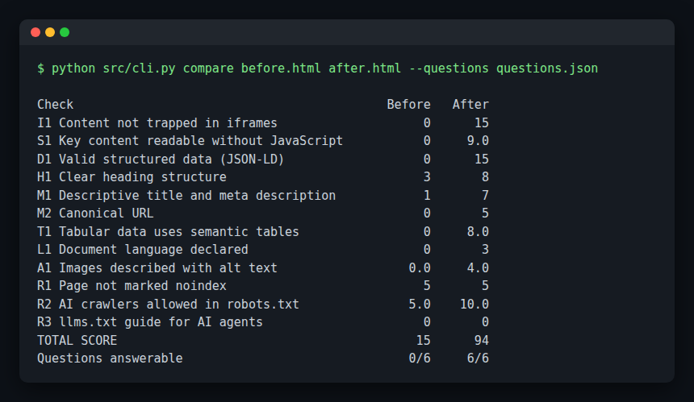

# AI Crawler & AEO Auditor

[](https://github.com/barath2211/ai-crawler-aeo-auditor/actions/workflows/tests.yml)  -success)  

> **About this repo:** An open-source reference implementation of the audit approach behind a migration I led at an enterprise SaaS company. It reproduces the method, not the original code. The company and figures in the sample pages are fictional.
>
> **Read the [case study](docs/CASE_STUDY.md):** 40+ components moved off a shared iframe; clients gained control of their data, indexing improved, and client content started showing up in AI answers.

A CLI that answers one question: **can AI assistants and search crawlers actually read, understand and quote this page?**

## Why this matters

More and more people ask ChatGPT, Claude, Perplexity or Google's AI answers instead of clicking through to a site. Those systems mostly read raw HTML. They don't run your JavaScript widgets, they don't credit iframe content to your domain, and they lean heavily on structured data.

The system this was modelled on served financial data to client websites through a shared, centrally hosted iframe. It looked fine in a browser, but to a crawler the client's own page was nearly empty, and the figures were attributed to the vendor's domain instead of the client's.

## What it checks

| ID | Check | Weight |
|---|---|---|
| I1 | Content not trapped in iframes | 15 |
| S1 | Key content readable without JavaScript | 15 |
| D1 | Valid JSON-LD structured data (Organization, Dataset, FAQPage...) | 15 |
| H1 | One `<h1>`, no skipped heading levels | 8 |
| T1 | Figures in semantic `<table>`s with headers and caption | 8 |
| M1 | Descriptive title and meta description | 7 |
| M2 | Canonical URL | 5 |
| R1 | Not marked `noindex` | 5 |
| R2 | AI crawlers (GPTBot, ClaudeBot, PerplexityBot, Google-Extended...) allowed in robots.txt | 10 |
| R3 | `llms.txt` published | 5 |
| A1 | Images and charts described in alt text | 4 |
| L1 | Document language declared | 3 |

Each failing check comes with the evidence and a specific fix.

### Answerability eval (the part that proves it)

A good score is hygiene. The real test is whether an assistant can answer the questions your audience asks. The auditor strips the page to what a non-JS crawler sees, gives it to an LLM along with a list of real questions, and checks the answers against expected values. Matching is strict about facts but tolerant of formatting: `1204.6`, `1,204.6` and `1 204.6` all count, while a hedged "NOT FOUND" never does, even if the number appears somewhere in the reply.

## Before and after

`data/fixtures/before.html` is a typical widget-based investor page. `after.html` is the same content rebuilt natively.



## Outcome in the original system

I led the move of **40+ client-facing components** off the shared iframe to native, per-client rendering: content that blends into each client's site, is indexable by AI systems and search engines, and gives each client independent control over their own data.

## Quick start

```bash
git clone https://github.com/barath2211/ai-crawler-aeo-auditor
cd ai-crawler-aeo-auditor
pip install -r requirements.txt

# Local files, no network, no model
python src/cli.py data/fixtures/before.html --robots data/fixtures/robots_before.txt

# A live page (fetches its robots.txt and llms.txt too), with reports
python src/cli.py https://your-site.example/investors --md report.md --json report.json

# In CI: fail the build if a page drops below 75
python src/cli.py dist/index.html --fail-under 75

# Answerability with a real model
LLM_PROVIDER=ollama python src/cli.py data/fixtures/after.html --questions data/fixtures/questions.json
```

Providers: `ollama`, `ollama-small` (8 GB laptops), `gemini`, `openai`, `anthropic`, `mock`. Auto-detected if not set. Models per role in [`config/models.json`](config/models.json).

## Docs

- [Case study](docs/CASE_STUDY.md)
- [PRD](docs/PRD.md)
- [Architecture](docs/ARCHITECTURE.md)
- [Evals and benchmarks](docs/EVALS_AND_BENCHMARKS.md)

## Limits

- Static analysis only. It deliberately does not run JavaScript, because most AI crawlers don't. Googlebot does render JavaScript, so a low S1 score hurts AI answers more than classic Google search.
- Weights are opinionated. They're in one place (`checks.py`) so you can tune them.
- AEO is a young field. Treat the score as a checklist, and the answerability eval as the real signal.

## License

MIT. Built by [Barath Kumar](https://github.com/barath2211).
