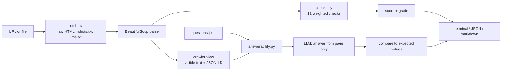

# Architecture

## Modules

| Module | Role |
|---|---|
| `fetch.py` | Loads a URL (plus site robots.txt and llms.txt) or a local file. No JS. |
| `checks.py` | Twelve independent checks. Each returns score, status, evidence, fix. `score()` normalises over applicable checks. |
| `answerability.py` | Builds the crawler view and asks the model each question with a strict "only from this content" prompt. |
| `llm.py` | Same provider-agnostic client used across my reference repos (Ollama, OpenAI-compatible, Anthropic, mock). |
| `cli.py` | `audit`, `compare`, report writers, CI exit code. |

## Scoring

- Each check has a weight; weights sum to 100.
- Checks that don't apply (e.g. robots.txt for a local file) are marked `n/a` and removed from the denominator, so local and remote scores stay comparable.
- Grade bands: A ≥ 90, B ≥ 75, C ≥ 60, D ≥ 40, F below.

## Answerability prompt contract

- System prompt: answer only from the provided content, reply `NOT FOUND` otherwise, include the exact figure.
- Content is truncated to 12k characters.
- Correctness = the answer contains any of the expected strings. Simple on purpose: it's robust across models and easy to audit.

## Extending

- Add a check: write a function returning `CheckResult`, add it to `run_all`, rebalance weights.
- Add a site-wide mode: crawl a sitemap and aggregate scores per template type.
